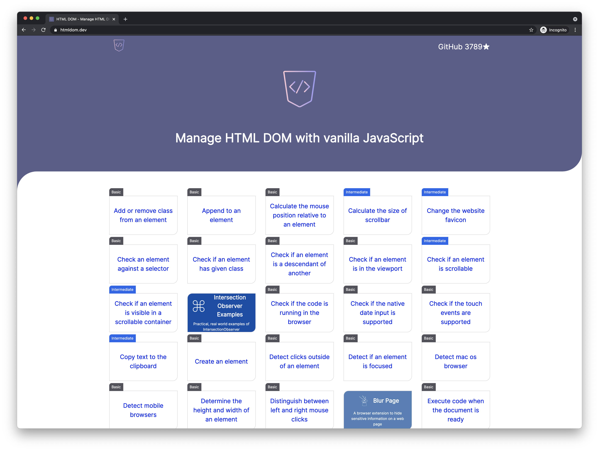

# HTML DOM

## Story

Web development goes very fast. I still remember the moments when starting to use [jQuery](https://jquery.com), [Prototype](http://prototypejs.org),
[script.aculo.us](https://script.aculo.us), [Zepto](https://zeptojs.com) and many more.

Nowadays, even if our application is powered by mordern tools such as Angular, Vue, React, Svelte, .etc, we have to deal with DOM.
The frameworks encapsulate and hide the DOM management directly, but still give us a door to work with DOM via _ref_, _event handlers_.

If you develop or use a web component in any framework, you have to work with DOM at a certain level.

Knowing the browser DOM APIs and how to use them play an important role in web development.
A website introducing the APIs, well-known problems, most popular questions could be very useful. 

## Features

* [x] No external library. Only native browsers' APIs
* [x] Small and easy to understand examples
* [x] Live demos
* [x] Many tips and good practices included
* [x] Many real use cases
* [x] Work with the modern browsers. _Try to support IE 11_



## Running it on local

1. Clone the project:

```shell
$ git clone https://github.com/phuoc-ng/html-dom
```

2. Install the dependencies:

```console
$ cd html-dom
$ npm install
```

3. Run it on the local:

```console
$ npm run serve
```

Look at the console to see the _Local URL_. Open it in your browser to see it in action.

## About

This project is developed by _Nguyen Huu Phuoc_. I love building products and sharing knowledge.

Be my friend on
* [Twitter](https://twitter.com/nghuuphuoc)
* [dev.to](https://dev.to/phuocng)
* [Github](https://github.com/phuoc-ng)

## Products

You might be interested in my products:

_Products_
* [Blur Page - A browser extension to hide sensitive information on a web page](https://blur.page)
* [Check Browsers Support - A browser extension to check browser compatibility without leaving your tab](https://checkbrowsers.support)
* [Fake Numbers - Generate fake and valid numbers](https://fakenumbers.io)
* [Form Validation - The best validation library for JavaScript](https://formvalidation.io)
* [IntersectionObserver Examples - Practical, real world examples of IntersectionObserver](https://intersectionobserver.io)
* [React PDF Viewer - A React component to view a PDF document](https://react-pdf-viewer.dev)

_Resources_
* [1LOC - Favorite JavaScript utilities in single line of code](https://1loc.dev)
* [CSS Layout - A collection of popular layouts and patterns made with CSS](https://csslayout.io)
* [HTML DOM - How to manage HTML DOM with vanilla JavaScript](https://htmldom.dev)
* [Responsive Design Patterns - A collection of patterns to create a responsive web page](https://responsive.page)
* [Super tiny, quick tips, tricks and best practices of front-end development](https://getfrontend.tips)
* [this VS that - The differences between ___ and ___ in the front-end development](https://thisthat.dev)