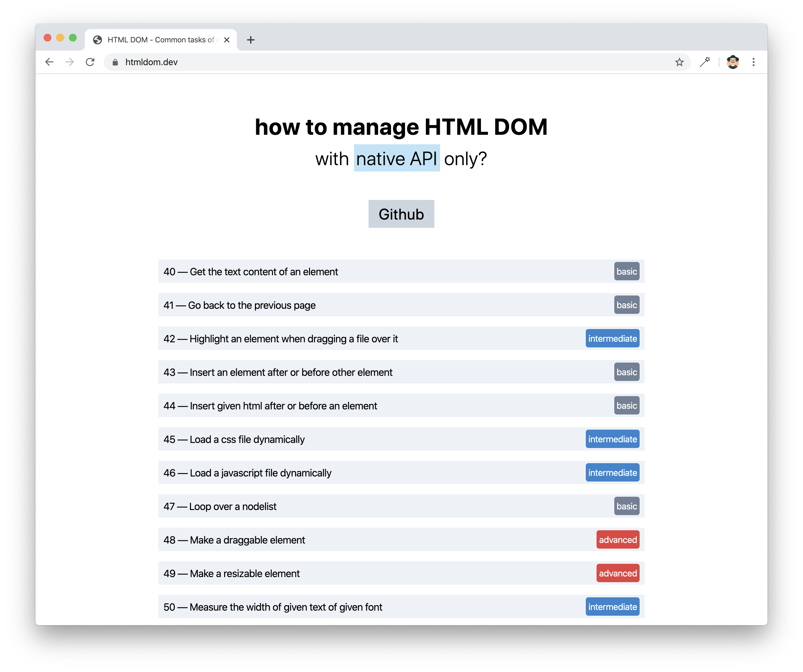

# HTML DOM
[英文版](htmldom.dev)  [中文版](www.htmldom.cn)

## 故事

Web开发发展的非常快，我仍然记得使用[jQuery](https://jquery.com "jQuery"), [Prototype](http://prototypejs.org "Prototype"), [script.aculo.us](https://script.aculo.us "script.aculo.us"), [Zepto](https://zeptojs.com, "Zepto") 等第三方库的时光。

如今，即使我们的项目可以由 [Angular](https://www.angular.io/ "Angular"), [Vue](https://www.vuejs.org/ "Vue"), [React](https://www.reactjs.org/ "React"), [Svelte](https://www.svelte.dev/ "Svelte")等流行框架进行搭建，我们也必须要操作 DOM。这些框架直接将 DOM 操作进行封装和隐藏，但仍然提供了例如，通过 React 的 ***ref 事件***来处理项目 DOM 元素的大门。

如果在任何框架中开发或是使用Web组件，则必须在一定程度上使用 DOM。

了解浏览器的 DOM API 以及如何使用它们，在Web开发中扮演者重要角色。
一个介绍 API，解决一些众所周知或是最流行的问题的网站可能会非常有用。

## 特征

* [x] 不使用第三方库，仅使用浏览器提供 DOM API
* [x] 小且易于理解的案例
* [x] 在线演示
* [x] 包含了许多技巧和优雅做法
* [x] 许多实际用例
* [x] 请使用现代流行浏览器运行。***项目尝试支持 IE 11***

## 在本地运行

1. 克隆项目:

~~~ console
$ git clone https://github.com/phuoc-ng/html-dom
~~~

2. 安装项目依赖:

~~~ console
$ cd html-dom
$ npm install
~~~

3. 在本地运行项目:

~~~
$ npm run dev-server
~~~

请在浏览器中打开 localhost:1234 查看实际的效果

## 贡献

非常欢迎拉去请求。如果在您的浏览器运行发现任何问题, 请您通过创建问题或是提交拉去请求来让我知道。谢谢

## 关于

该项目是由 _Nguyen Huu Phuoc_. 我非常喜欢开发产品和知识分享.

成为我的朋友吧:
* [Twitter](https://twitter.com/nghuuphuoc)
* [dev.to](https://dev.to/phuocng)
* [Github](https://github.com/phuoc-ng)

## 产品展示

你可能会对我的项目感兴趣:

| 产品                                           | 描述                                                       |
|---------------------------------------------------|-------------------------------------------------------------------|
| [Blur Page](https://blur.page)                    | 浏览器扩展程序，用于隐藏网页上的敏感信息   |
| [CSS Layout](https://csslayout.io)                | 使用 CSS 制作的流行布局和图案的集合        |
| [Fake Numbers](https://fakenumbers.io)            | 能够生成指定模拟数值的 JavaScript 工具库                                   |
| [Form Validation](https://formvalidation.io)      | 最佳体验的 JavaScript 验证库                        |
| [HTML DOM](https://www.htmldom.cn)                | 如何使用原生 JavaScript 来管理 HTML DOM                    |
| [React PDF Viewer](https://react-pdf-viewer.dev)  | 使用 React 框架制作的 PDF 查看器                          |
